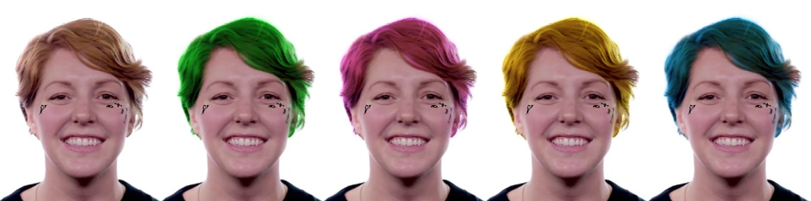

# Hair-Segmentation-And-Recoloring
This is the project for my subject Image Processing and Applications - CS406.M11

## Report
- [ ] (``Doing``)

## Dataset

* [CelebA](http://mmlab.ie.cuhk.edu.hk/projects/CelebA.html)

## Method

* [UNET](https://towardsdatascience.com/understanding-semantic-segmentation-with-unet-6be4f42d4b47)
* Multiply

## Result

## References

* [RIS AI HairNET Hair & Head Segmentation](https://www.youtube.com/watch?v=__zKgNb2Qp8&t=449s)
* ...

